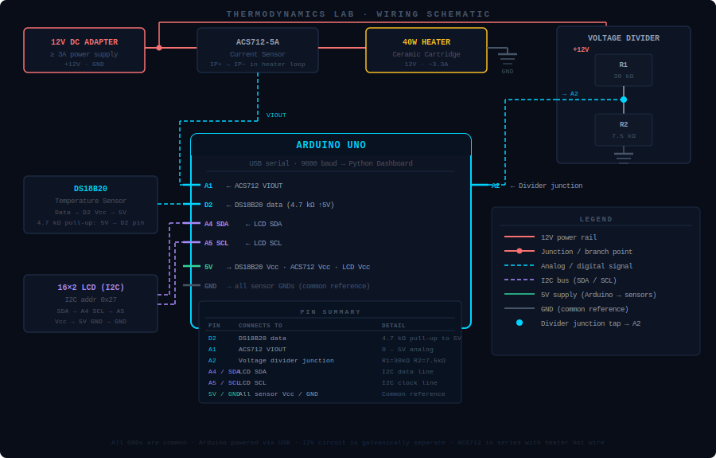

# Thermodynamics Lab


An Arduino-connected dashboard that **proves the 1st Law of Thermodynamics** in real time — measures electrical energy input and heat absorbed by water, then computes efficiency and verifies energy conservation.

---

## Download the Dashboard

<a href="https://github.com/arunishrajput/thermodynamics-lab/releases/latest/download/ThermodynamicsLab.exe">
  
</a>
&nbsp;
<a href="https://github.com/arunishrajput/thermodynamics-lab/releases/latest/download/ThermodynamicsLab-macOS.zip">
  
</a>

> **macOS first run:** unzip → right-click `ThermodynamicsLab.app` → **Open** → click Open again.  
> This is a one-time Gatekeeper bypass because the app is not signed with an Apple certificate.

---

## How It Works

The Arduino reads three sensors every ~6 seconds, computes power and cumulative energy, and sends one CSV line over USB serial. The Python dashboard receives it, plots temperature in real time, and — after you press START / STOP — calculates the 1st Law balance:

| Symbol | Formula | Meaning |
|--------|---------|---------|
| **W** | `ΔE_electrical = ∫P dt` | Electrical energy supplied to the heater |
| **Q** | `m · c · ΔT` | Heat absorbed by the water |
| **Loss** | `W − Q` | Energy dissipated to the environment |
| **η** | `Q / W × 100 %` | Thermal conversion efficiency |

> **W = Q + Q_loss** — energy in equals useful heat plus losses. The dashboard prints a colour-coded verdict confirming the 1st Law after every experiment.

---

## Hardware

| Component | Purpose |
|-----------|---------|
| Arduino Uno / Nano / Mega | Reads sensors, sends CSV at 9600 baud |
| DS18B20 temperature sensor | Water temperature (°C) — data pin → D2 |
| ACS712-5A current sensor | Heater current (A) — output → A1 |
| Voltage divider module | 12 V rail sensing — output → A2 |
| 16×2 I2C LCD (addr 0x27) | Local display (Temp / V+I / Energy screens) |
| 40 W ceramic cartridge heater | Heats the water, powered by 12 V DC |
| 12 V DC adapter | Power source for the heater |

### Schematic



### Wiring notes

| Connection | Detail |
|-----------|--------|
| DS18B20 data → D2 | 4.7 kΩ pull-up resistor between the data line and 5 V |
| ACS712 IP+ / IP− | In series with the heater hot wire (measures current through the heater) |
| Voltage divider → A2 | R1 = 30 kΩ (top), R2 = 7.5 kΩ (bottom). Junction scales 0–25 V → 0–5 V (×5 factor in firmware) |
| LCD SDA → A4, SCL → A5 | Standard I2C on Uno. Change pins for Mega/Nano if needed |
| All GNDs | Common reference — connect Arduino GND, 12 V supply GND, and sensor GNDs together |

---

## Arduino Setup

### 1 — Install libraries

Open the Arduino IDE, go to **Sketch → Include Library → Manage Libraries**, and install:

| Library | Author |
|---------|--------|
| `LiquidCrystal I2C` | Frank de Brabander |
| `OneWire` | Paul Stoffregen |
| `DallasTemperature` | Miles Burton |

`Wire.h` is built into the Arduino IDE — no install needed.

### 2 — Upload the sketch

1. Open [`arduino/ThermodynamicsLab.ino`](arduino/ThermodynamicsLab.ino) in the Arduino IDE.
2. Select your board (**Tools → Board**) and port (**Tools → Port**).
3. Click **Upload**.
4. The LCD will show `SMART THERMO / Starting...` for 2 seconds, then begin cycling through three data screens.

### 3 — Verify serial output

Open **Tools → Serial Monitor** at **9600 baud**. You should see lines like:

```
24.5,11.87,3.21,38.10,1245.0,1
```

If temperature reads `-127.0`, check the DS18B20 wiring and the 4.7 kΩ pull-up.

### Calibration notes

| Parameter | Value in firmware | When to change |
|-----------|------------------|----------------|
| Voltage scale factor | `× 5.0` | Change if you use a different R1/R2 ratio |
| ACS712 sensitivity | `0.185 V/A` | Use `0.100` for ACS712-20A, `0.066` for ACS712-30A |
| Current noise gate | `0.30 A` | Lower if your heater draws < 1 A; raise to reduce flicker |

---

## Serial Data Format

The dashboard expects exactly this CSV line at **9600 baud**, once per loop (~6 s):

```
temperature,voltage,current,power,energy,heater_status
```

| Field | Type | Unit | Notes |
|-------|------|------|-------|
| temperature | float | °C | DS18B20 reading |
| voltage | float | V | Scaled from voltage divider |
| current | float | A | ACS712, rectified, noise-gated |
| power | float | W | `voltage × current` |
| energy | float | J | Cumulative since Arduino boot |
| heater_status | int 0/1 | — | 1 = heater ON |

---

## Dashboard Features

| Feature | Details |
|---------|---------|
| **Live sensor cards** | Temperature, Voltage, Current, Power, Energy, Heater — updated every second |
| **Real-time graph** | Temperature vs time with glow fill, auto-scales |
| **Experiment mode** | START captures T₀ and E₀ · STOP captures T₁ and E₁ · live timer |
| **Results panel** | T₀, T₁, ΔT, Q, W, η — scrollable so nothing is cropped |
| **1st Law analysis** | Full W / Q / Loss / η breakdown with colour-coded verdict |
| **Port selector** | Auto-detect or manually choose a COM/serial port |
| **Connection status** | Live indicator; detects unexpected disconnects automatically |
| **Configurable parameters** | Water mass and specific heat · liquid preset dropdown (Water, Ethanol, Motor Oil, Glycerin, Mercury, Custom) · persists between sessions |
| **CSV export** | Save the full temperature log to a `.csv` file |
| **Scrollable sidebar** | All panels scroll independently — nothing hidden at any window size |

---

## Running from Source

```bash
git clone https://github.com/arunishrajput/thermodynamics-lab.git
cd thermodynamics-lab

python -m venv venv
source venv/bin/activate       # Windows: venv\Scripts\activate

pip install -r requirements.txt
python dashboard.py
```

---

## Building the Executable Locally

**Windows:**
```bat
build_windows.bat
# Output: dist\ThermodynamicsLab.exe
```

**macOS:**
```bash
./build_mac.sh
# Output: dist/ThermodynamicsLab-macOS.zip
```

---

## Project Context

This project was built to experimentally verify the **1st Law of Thermodynamics** — energy cannot be created or destroyed, only converted. By heating a known mass of water with a measured electrical input and tracking the temperature rise, we directly compare work input (W) with heat output (Q) and account for losses to the environment.
